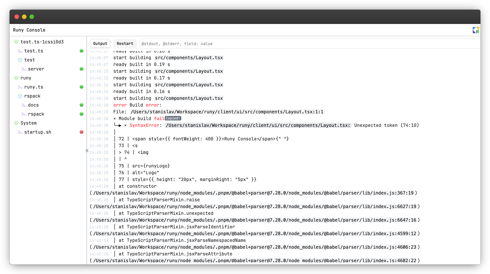

# Runy

> **Note**: This repository contains documentation and SDK code only. The core Runy binary is written in Rust and remains closed source, though we may open-source it in the future.

Runy is a developer console and process manager designed to simplify development workflows by providing a unified interface for running, monitoring, and controlling applications.

## Overview



Tired of juggling multiple terminal windows and tabs? Runy eliminates the complexity of managing development processes by offering a centralized solution that keeps your workspace organized and productive.

## Key Features

### Process Management
- **Unified Control**: Start, stop, and monitor development processes from one place
- **Background Execution**: Run processes in the background without keeping terminal windows open
- **Workspace Organization**: Group related processes and services into logical workspaces

### Web Interface
- **Browser-based Dashboard**: Access a beautiful web console at `http://localhost:4122`
- **Real-time Monitoring**: View logs, performance metrics, and system status
- **Visual Process Control**: Manage all processes through an intuitive web interface

### TypeScript SDK
- **Type-safe Configuration**: Write configuration files using modern TypeScript
- **Full IDE Support**: Get autocompletion, validation, and type safety
- **Service Lifecycle Management**: Define complex service dependencies and behaviors

### Daemon Architecture
- **Client-Server Model**: Efficient gRPC communication between CLI and daemon
- **Automatic Management**: Daemon starts automatically when needed
- **Background Services**: Processes continue running even when CLI is closed

## Installation

Multiple installation methods available:

- **Install Script**: `curl --proto '=https' --tlsv1.2 -sLSf https://sh.runy.dev | sh`
- **Homebrew**: `brew tap runy-dev/runy && brew install runy`
- **Manual Download**: Available from GitHub releases

## Getting Started

Start a simple process:
```bash
runy start "python3 -m http.server"
```

Create a workspace with the TypeScript SDK:
```typescript
import { workspace } from "@runy-dev/core";

const ws = workspace(import.meta);

ws.service("web-server", (s) => {
  s.autorun();
  s.run(async (ctx) => {
    await ctx.process({
      alias: "server",
      cmd: "python3",
      args: ["-m", "http.server", "8500"],
    });
  });
});
```

Access the web console at `http://localhost:4122` to monitor and control your processes visually.